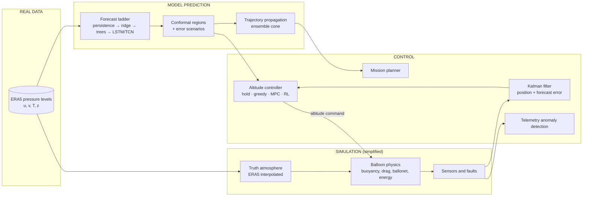
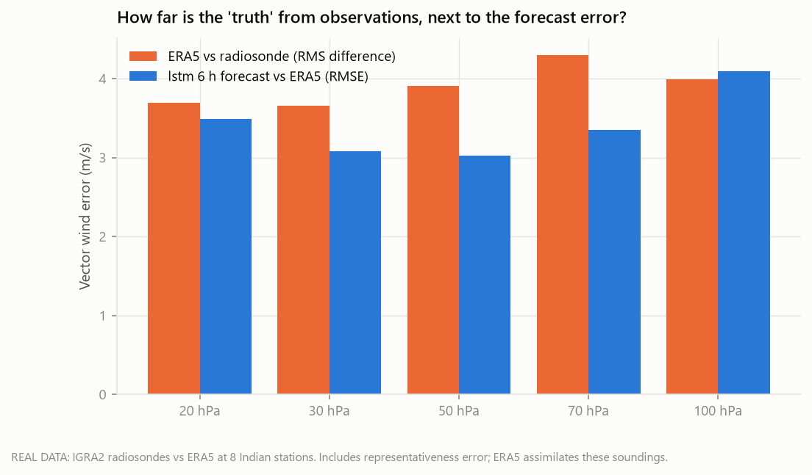
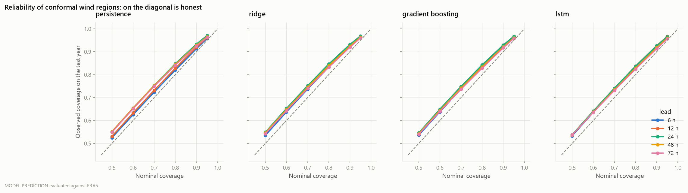
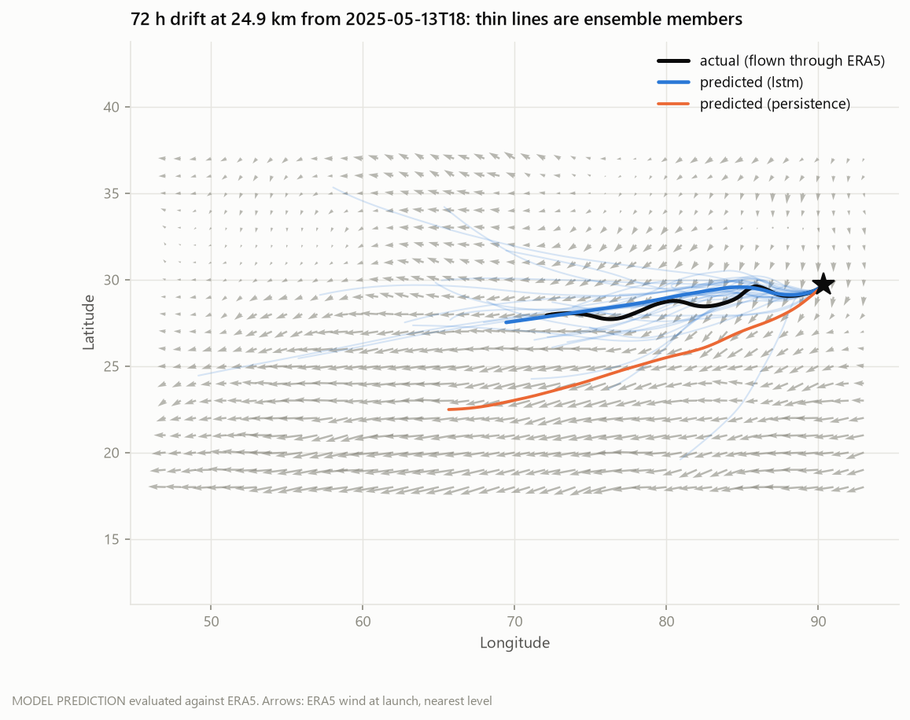
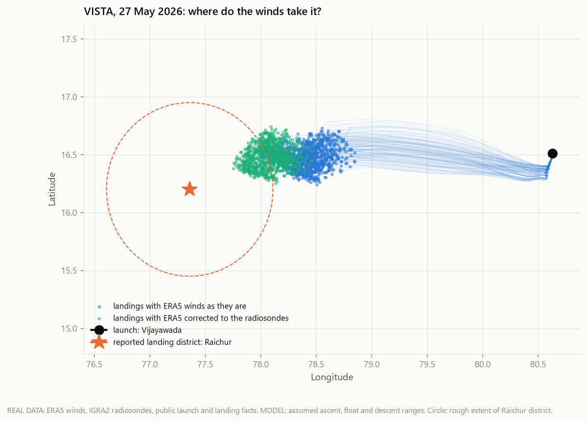
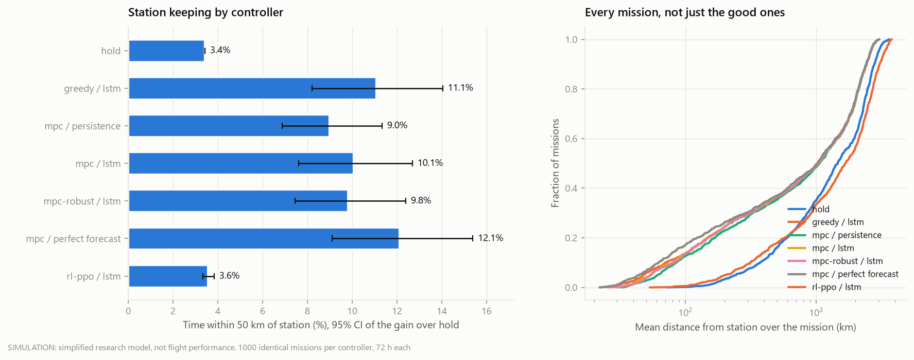
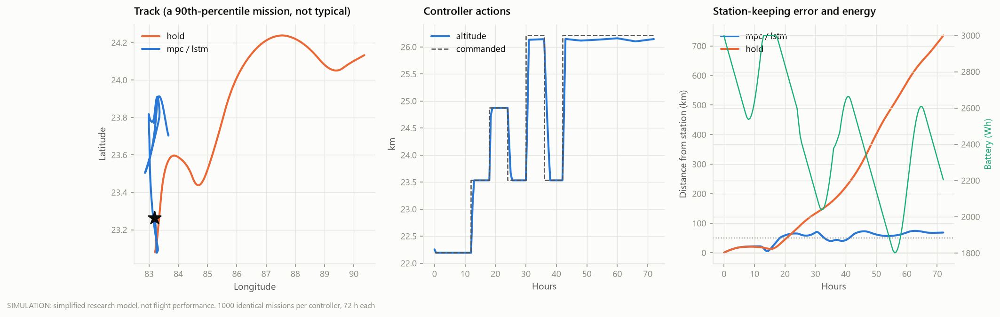
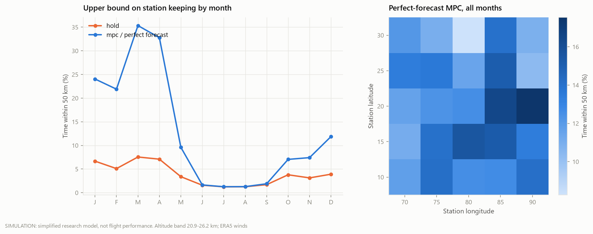
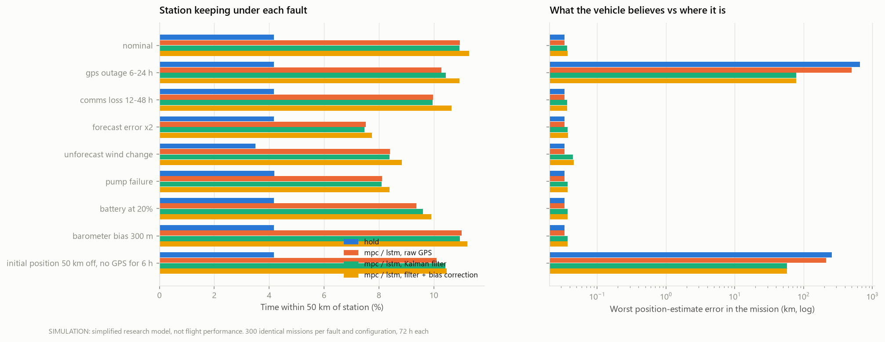

# Stratospheric balloon autonomy: forecasting, uncertainty and altitude control

A research-grade simulation study of how an **altitude-controlled super-pressure
balloon** could hold position over South Asia. It forecasts the wind at 20-26 km
from real ERA5 data with calibrated uncertainty, estimates its own state from noisy
sensors, and chooses its altitude to ride wind layers that blow in different
directions. Every component is scored against simpler baselines on missions it
never trained on.

> **What is real and what is not.** Every result below is labelled as one of four
> kinds. **REAL DATA** is ERA5 reanalysis. **MODEL PREDICTION** is a forecast
> scored against ERA5. **SIMULATION** is a simplified research model of a
> balloon; it is not flight-certified and none of its numbers are flight
> performance. **CONTROL** is the onboard decision logic. The balloon has never
> flown.

<!-- AUTO:provenance -->
Results below were generated from `data/era5/era5_*.nc` (132 monthly files, dataset checksum `36acfc4d5813`), pressure levels [100, 70, 50, 30, 20] hPa, with 2025 as the held-out test year. Configuration: `configs/experiment.yaml`.
<!-- /AUTO:provenance -->

## The problem

A super-pressure balloon has no engine. It floats at a nearly constant air
density and goes wherever the wind takes it. The only way to steer is to change
altitude, by pumping air into an internal ballonet to sink or venting it to rise,
and let the wind at the new altitude carry it. Loon used this to keep balloons
over a region for weeks (Bellemare et al., *Nature* 2020). Red Balloon Aerospace
flew India's first indigenous super-pressure balloon, VISTA, from Vijayawada in May
2026 at a design altitude of about 25 km.

Station keeping therefore depends on four things this project builds and
measures: knowing the wind at each reachable altitude in advance, knowing how
wrong that forecast might be, knowing where the balloon actually is, and choosing
altitudes well. It also depends on whether the atmosphere offers opposing wind
layers at all, which the project measures too.

## System architecture



The controller never reads the truth atmosphere. It sees noisy sensors and a
forecast issued every 6 hours, which goes stale if the ground link drops.

## Data (REAL DATA)

ERA5 hourly reanalysis on pressure levels from the Copernicus Climate Data Store,
downloaded 6-hourly at 1° over 0-40°N, 40-130°E, at 100, 70, 50, 30 and 20 hPa
(about 16.5-26.5 km), with wind, temperature and geopotential, from 2015 to 2025.
Altitudes come from geopotential, not from a standard atmosphere. The downloader
(`python -m stratoballoon.data.era5`) is sequential and resumable, and writes a
SHA-256 manifest so every result can name the exact files it used.

**How good is the "truth"?** ERA5 is compared with radiosonde soundings
(weather balloons, NOAA IGRA2) at eight Indian stations, at the pressure levels
both share:

<!-- AUTO:radiosondes -->
| level | soundings | ERA5 vs radiosonde, vector RMS (m/s) | forecast 6 h vs ERA5, vector RMSE (m/s) | mean observed speed (m/s) |
|---|---|---|---|---|
| 20 hPa | 13787 | 3.69 | 3.49 | 13.7 |
| 30 hPa | 15408 | 3.66 | 3.08 | 12.1 |
| 50 hPa | 17558 | 3.91 | 3.03 | 11.0 |
| 70 hPa | 19131 | 4.30 | 3.35 | 13.5 |
| 100 hPa | 21256 | 4.00 | 4.09 | 20.2 |

The reanalysis differs from the soundings by 1.2x the forecast's 6-hour error against the reanalysis. Part of that is representativeness (a drifting point measurement against a ~100 km grid box), and ERA5 assimilates these soundings, so it is a lower bound on ERA5's error away from stations. If the two errors were independent they would add in quadrature, putting the forecast's 6-hour error against real observations nearer 5.1 m/s at 20 hPa, 4.8 m/s at 30 hPa, 4.9 m/s at 50 hPa, 5.4 m/s at 70 hPa, 5.7 m/s at 100 hPa than the figures scored against ERA5 suggest.
<!-- /AUTO:radiosondes -->



**Splits.** Chronological with a 3-day embargo at each boundary. The forecast
ladder is evaluated on 2022, 2023 and 2024 in turn, each time trained on every
earlier year and validated on the year before. **2025 is the final hold-out**,
used once, for the results below, after every choice had been made on earlier
years.

## Wind forecasting (MODEL PREDICTION)

Each model predicts the change from the current wind (persistence) at every
level, 6 to 72 hours ahead, from 24 hours of history at that grid column. Models
are pooled over grid columns, so one model forecasts anywhere in the domain. The
rule for keeping a model was stated in advance: ridge regression is the default,
and a more complex model replaces it only if it beats ridge outside the
block-bootstrap 95% confidence interval in most lead-time and level
combinations, judged on the rolling test years before the hold-out year.

<!-- AUTO:forecast -->
Vector-RMSE skill against persistence (%), mean over pressure levels, test year 2025. Higher is better; negative is worse than assuming the wind stays as it is.

| model | 6 h | 12 h | 24 h | 48 h | 72 h |
|---|---|---|---|---|---|
| tide persistence | 4.9 | 3.9 | 0.0 | 0.0 | 0.0 |
| climatology | -121.7 | -78.9 | -81.2 | -48.5 | -35.1 |
| moving average | 1.5 | 11.0 | -1.1 | 2.6 | 3.4 |
| linear | 21.7 | 24.2 | 14.9 | 15.0 | 14.1 |
| ridge | 21.7 | 24.2 | 14.9 | 15.0 | 14.1 |
| gradient boosting | 26.5 | 28.3 | 18.1 | 17.4 | 16.9 |
| lstm | 27.4 | 29.0 | 18.3 | 18.2 | 17.6 |
| tcn | 27.0 | 28.9 | 18.8 | 18.8 | 18.1 |

- **gradient boosting vs ridge**: mean skill +4.3%, significantly better in 88% of (horizon, level) cells.
- **lstm vs ridge**: mean skill +5.1%, significantly better in 88% of (horizon, level) cells.
- **tcn vs ridge**: mean skill +5.4%, significantly better in 100% of (horizon, level) cells.

Mean skill over all lead times and levels, by rolling test year (each model retrained on the years before it):

| test year | ridge | gradient boosting | lstm | tcn |
|---|---|---|---|---|
| 2022 | 17.6 | 21.1 | 21.6 | 21.7 |
| 2023 | 18.1 | 22.0 | 22.7 | 22.8 |
| 2024 | 17.9 | 21.8 | 23.1 | 22.6 |
| 2025 | 18.0 | 21.4 | 22.1 | 22.3 |

**Selected forecaster: lstm.** The choice was made on the test years before 2025 only: among models that beat ridge outside the block-bootstrap interval in most lead-time and level combinations, the one with the highest mean skill. 2025 did not influence it. Against the next simpler model, gradient boosting, lstm has 0.9% lower error on 2025 and is significantly better in 56% of lead-time and level combinations. That margin is small: gradient boosting would be a defensible choice where a simpler model is preferred.
<!-- /AUTO:forecast -->

**Which inputs matter** (the ridge forecaster retrained without each input
group; ridge is used here because it retrains in seconds and its inputs are the
same as every other model's):

<!-- AUTO:ablation -->
| input group | error increase without it, 6 h (%) | error increase without it, 24 h (%) |
|---|---|---|
| northward wind v | +13.7 | +10.3 |
| eastward wind u | +6.7 | +4.6 |
| 20 hPa level | +6.5 | +3.0 |
| 30 hPa level | +6.1 | +3.0 |
| 50 hPa level | +6.1 | +3.7 |
| 70 hPa level | +5.5 | +4.9 |
| older half of history | +3.2 | +1.3 |
| 100 hPa level | +2.8 | +4.8 |
| temperature | +0.9 | +0.9 |
| time of day | +0.2 | +0.0 |
| position | +0.1 | +0.3 |
| season | +0.0 | +0.1 |
<!-- /AUTO:ablation -->

## Forecast uncertainty (MODEL PREDICTION)

The controller is never given a bare forecast. Split-conformal prediction turns
the previous year's forecast errors into a region around each forecast wind
vector that should contain the truth a stated fraction of the time; sampled
error scenarios (whole error vectors drawn from that year, across all lead times
and levels at once) give the controller possible futures to plan against.
Plain conformal regions are only right on average and only if next year
behaves like last year. Two remedies are compared: a regime-conditional variant
calibrated separately for weak, moderate and strong wind at issue time, and
adaptive conformal inference, which adjusts the coverage level online as
forecasts verify (each only after its lead time has passed).

<!-- AUTO:uncertainty -->
Observed coverage (%) of the conformal wind regions of the lstm forecast on the test year, calibrated on the year before.

| nominal | 6 h | 12 h | 24 h | 48 h | 72 h |
|---|---|---|---|---|---|
| 50% | 53.3 | 53.8 | 53.8 | 53.7 | 53.7 |
| 60% | 63.5 | 64.1 | 64.1 | 63.7 | 63.6 |
| 70% | 73.6 | 74.1 | 74.1 | 73.5 | 73.1 |
| 80% | 83.2 | 83.7 | 83.7 | 82.9 | 82.4 |
| 90% | 92.3 | 92.7 | 92.6 | 91.8 | 91.3 |
| 95% | 96.5 | 96.7 | 96.6 | 96.0 | 95.6 |

Coverage is only guaranteed on average: at 6 h it drops to 89% for the 'strong' wind group (nominal 90%).

Marginal, regime-conditional and adaptive calibration, coverage (%) of the 90% region at 6 h, grouped by the wind at issue time:

| wind when issued | marginal | regime | adaptive |
|---|---|---|---|
| all | 92.3 | 92.1 | 90.3 |
| weak now | 94.4 | 91.5 | 93.2 |
| moderate now | 93.0 | 92.4 | 91.3 |
| strong now | 89.6 | 92.6 | 86.5 |

The sampled-scenario ensemble scores 28% better at 6 h, 28% better at 12 h, 27% better at 24 h, 25% better at 48 h, 25% better at 72 h than the point forecast on CRPS (equal to MAE for a single forecast).
<!-- /AUTO:uncertainty -->



## Trajectory prediction (MODEL PREDICTION)

<!-- AUTO:trajectory -->
Median distance (km) between predicted and actual position of a balloon drifting at fixed altitude, with no forecast updates after launch. Scored tracks per lead: 6 h: 600, 12 h: 600, 24 h: 600, 48 h: 499, 72 h: 369 (tracks that leave the data domain stop being scored).

| forecast | 6 h | 12 h | 24 h | 48 h | 72 h |
|---|---|---|---|---|---|
| gradient boosting | 18 | 50 | 105 | 259 | 458 |
| lstm | 18 | 49 | 105 | 267 | 464 |
| persistence | 27 | 86 | 180 | 422 | 732 |
| ridge | 19 | 52 | 110 | 278 | 494 |

Uncertainty-cone coverage (%):

| cone | 6 h | 12 h | 24 h | 48 h | 72 h |
|---|---|---|---|---|---|
| 80% | 88 | 89 | 90 | 88 | 84 |
| 95% | 97 | 98 | 98 | 97 | 97 |

Probability of still being within 200 km of launch, Brier score (lower is better), ensemble / single forecast / climatology: 6 h 0.017 / 0.025 / 0.244; 12 h 0.028 / 0.033 / 0.170; 24 h 0.036 / 0.048 / 0.085; 48 h 0.033 / 0.042 / 0.041; 72 h 0.022 / 0.043 / 0.024.
<!-- /AUTO:trajectory -->



### Case study: Red Balloon's VISTA flight (REAL DATA, sparse)

VISTA launched from Vijayawada on 27 May 2026, was reported at 12.2 km over
Guntur at 10:05 IST, reached nearly 25 km, flew for 7 h 30 min (it was designed
for 24 h) and was recovered in Raichur district. No track has been published.
So this asks whether ERA5 winds, flown with every ascent, float and descent
profile consistent with those facts, carry the balloon to Raichur; what
radiosondes measured at balloon altitude that week; and which change would
close the gap.

<!-- AUTO:vista -->
**The reconstruction falls short.** Of 2000 assumed flight profiles, 965 match the reported 12.2 km over Guntur at 10:05 IST. Flown through ERA5 winds, they cover a median 235 km and land a median 117 km from Raichur town (median landing 16.47 N, 78.42 E); 1% land within 80 km of it. Vijayawada to Raichur is 351 km in a straight line, so the balloon had to average 13 m/s westward for the whole flight, including the slow climb.

**What radiosondes measured.** Mean eastward wind at the four nearest stations (Machilipatnam, Hyderabad, Visakhapatnam, Bengaluru) over 24-30 May 2026, against ERA5 at the same stations on the flight day. Negative is towards the west.

| level | radiosondes, eastward wind (m/s) | ERA5 on the flight day (m/s) | difference (m/s) | days with soundings |
|---|---|---|---|---|
| 70 hPa (~18.7 km) | -13.1 | -9.4 | -3.6 | 7 |
| 50 hPa (~20.7 km) | -12.6 | -14.4 | +1.8 | 7 |
| 30 hPa (~23.9 km) | -13.9 | -11.6 | -2.3 | 7 |
| 20 hPa (~26.5 km) | -10.9 | -8.5 | -2.4 | 7 |

**What closes the gap.** The same reconstruction with one change at a time:

| scenario | median distance flown (km) | median miss from Raichur town (km) | landing within 80 km (%) |
|---|---|---|---|
| ERA5 winds, float 22-26.5 km, 7.5 h aloft (baseline) | 235 | 117 | 1 |
| float lower, 18-22 km | 291 | 71 | 63 |
| ERA5 corrected to the week's radiosonde means | 272 | 85 | 37 |
| corrected winds and float 18-24 km | 280 | 75 | 58 |
| ERA5 winds, 9.5 h aloft | 309 | 44 | 100 |

Correcting ERA5 to the measured winds closes about 28% of the miss; no single change within the assumed 7.5 hours closes all of it. A longer time aloft would, and the public record does not say whether 7 h 30 min is the whole flight or the time at float. A flight track would settle it.
<!-- /AUTO:vista -->



## The balloon (SIMULATION)

A sealed envelope of fixed volume with a ballonet, sized so that an empty
ballonet floats at the top of the commandable band and a full one at the bottom.
Vertical motion is drag-limited motion towards neutral buoyancy; horizontal
velocity equals the wind. Pumping air in costs energy against the envelope's
super-pressure, venting is free, and a battery with solar charging bounds what
the controller can do. Sensors add GPS and barometer noise. Every assumption, and
everything not modelled, is listed at the top of
[`src/stratoballoon/dynamics.py`](src/stratoballoon/dynamics.py).

## Altitude control (CONTROL, flown in SIMULATION)

| Controller | What it does |
|---|---|
| Hold | Never changes altitude. The do-nothing baseline. |
| Greedy | Every 3 h, picks the altitude whose forecast wind brings the balloon closest to the station over the next 6 h. |
| MPC | Searches 135 altitude plans over 24 h, executes the first step, re-plans every 3 h. |
| MPC, uncertainty-aware | Re-scores MPC's 15 best plans against 8 sampled forecast-error scenarios, weighting the worst 20% of outcomes. |
| RL (PPO) | A policy trained on validation-year missions with a reward for time near the station, progress, energy and safety. |
| MPC with a perfect forecast | The upper bound: the same MPC given the real future wind. |

All controllers fly the **identical** set of seeded missions in the test year,
72 hours each, starting at a random station and altitude. The metric is the
fraction of time within 50 km of the station (TWR50, as in Loon's work). Every
mission is reported.

<!-- AUTO:control -->
| controller / forecast | time within 50 km (%) | gain over hold (pp, 95% CI) | median mean distance (km) | pump energy (Wh) | altitude changes | left domain (%) |
|---|---|---|---|---|---|---|
| hold | 3.4 | +0.0 [+0.0, +0.0] | 1462 | 17 | 0.0 | 36 |
| greedy / lstm | 11.1 | +7.7 [+4.8, +10.6] | 1038 | 449 | 3.2 | 22 |
| mpc / persistence | 9.0 | +5.6 [+3.5, +7.9] | 1062 | 527 | 4.1 | 23 |
| mpc / lstm | 10.1 | +6.6 [+4.2, +9.3] | 1045 | 380 | 3.1 | 22 |
| mpc-robust / lstm | 9.8 | +6.4 [+4.0, +9.0] | 1038 | 407 | 3.6 | 22 |
| mpc / perfect forecast | 12.1 | +8.7 [+5.7, +12.0] | 1025 | 327 | 2.7 | 21 |
| rl-ppo / lstm | 3.6 | +0.1 [-0.1, +0.4] | 1668 | 16 | 0.2 | 44 |

Paired comparisons on identical missions (cluster bootstrap by launch week):

- MPC against the greedy rule: worse by 1.0 percentage points (95% CI -1.5 to -0.5).
- uncertainty-aware MPC against deterministic MPC: no significant difference (-0.3 percentage points, 95% CI -0.6 to +0.1).
- MPC with lstm against MPC with persistence: better by 1.1 percentage points (95% CI +0.6 to +1.6).
- a perfect forecast against lstm: better by 2.0 percentage points (95% CI +1.2 to +3.0).
- reinforcement learning against MPC: worse by 6.5 percentage points (95% CI -9.0 to -4.1).
<!-- /AUTO:control -->



One mission in detail. It is a 90th-percentile mission by time on station, chosen
to show how altitude control works when the winds allow it; the typical mission
in the table above is far less successful.



<!-- AUTO:season -->
Time within 50 km (%) by season of launch:

| controller / forecast | DJF | MAM | JJAS | ON |
|---|---|---|---|---|
| hold | 4.9 | 5.3 | 1.4 | 2.7 |
| greedy / lstm | 18.7 | 21.6 | 1.5 | 4.9 |
| mpc / persistence | 15.1 | 17.3 | 1.5 | 4.0 |
| mpc / lstm | 16.5 | 19.6 | 1.5 | 5.0 |
| mpc-robust / lstm | 16.8 | 18.5 | 1.5 | 4.7 |
| mpc / perfect forecast | 21.0 | 23.1 | 1.5 | 5.9 |
| rl-ppo / lstm | 5.4 | 5.4 | 1.4 | 2.9 |
<!-- /AUTO:season -->

**Is station keeping possible at all?** Before comparing controllers it is worth
asking where and when the atmosphere allows it:

<!-- AUTO:feasibility -->
Time within 50 km (%) by launch month, with a perfect forecast (the upper bound no forecaster can beat) and with no control:

| controller | J1 | F2 | M3 | A4 | M5 | J6 | J7 | A8 | S9 | O10 | N11 | D12 |
|---|---|---|---|---|---|---|---|---|---|---|---|---|
| hold | 6.7 | 5.1 | 7.6 | 7.1 | 3.4 | 1.6 | 1.3 | 1.3 | 1.7 | 3.8 | 3.1 | 3.9 |
| mpc / perfect forecast | 24.0 | 21.9 | 35.3 | 32.8 | 9.6 | 1.7 | 1.3 | 1.3 | 1.9 | 7.0 | 7.4 | 11.9 |
<!-- /AUTO:feasibility -->



## Robustness (SIMULATION)

The same missions flown through injected faults: GPS outage, loss of the ground
link (no new forecasts), doubled forecast error, an unforecast wind change, pump
failure, a weak battery, a biased barometer and a wrong initial position.

<!-- AUTO:robustness -->
Time within 50 km (%) under each injected fault:

| fault | hold (%) | mpc / lstm, Kalman filter (%) | mpc / lstm, filter + bias correction (%) | mpc / lstm, raw GPS (%) |
|---|---|---|---|---|
| nominal | 4.2 | 10.9 | 11.3 | 11.0 |
| gps outage 6-24 h | 4.2 | 10.4 | 10.9 | 10.3 |
| comms loss 12-48 h | 4.2 | 10.0 | 10.7 | 10.0 |
| forecast error x2 | 4.2 | 7.5 | 7.8 | 7.5 |
| unforecast wind change | 3.5 | 8.4 | 8.8 | 8.4 |
| pump failure | 4.2 | 8.1 | 8.4 | 8.1 |
| battery at 20% | 4.2 | 9.6 | 9.9 | 9.4 |
| barometer bias 300 m | 4.2 | 11.0 | 11.2 | 11.0 |
| initial position 50 km off, no GPS for 6 h | 4.2 | 10.4 | 10.5 | 10.1 |

During GPS outages the worst position-estimate error is 500 km holding the last fix, against 78 km with the Kalman filter dead-reckoning.
<!-- /AUTO:robustness -->



## Telemetry anomaly detection (SIMULATION)

Synthetic onboard telemetry, with the day/night coupling between sun, gas
pressure, battery and payload temperature, and eight injected fault types. Every
detector's alarm threshold is set to the same false-alarm budget on healthy
telemetry, then scored on telemetry with faults.

<!-- AUTO:anomaly -->
| detector | faults caught (%) | median delay (min) | false alarms per day | alarm precision (%) |
|---|---|---|---|---|
| threshold | 74 | 0 | 0.50 | 57 |
| residual + CUSUM | 95 | 0 | 0.59 | 64 |
| isolation forest | 41 | 16 | 0.39 | 41 |
| autoencoder | 100 | 0 | 0.58 | 51 |
<!-- /AUTO:anomaly -->

## Onboard compute

<!-- AUTO:edge -->
Measured on the development PC (x86, one thread), not flight hardware:

| component | where it should run | median latency (ms) | size (KB) |
|---|---|---|---|
| forecast one column (ridge) | ground (or onboard fallback) | 0.27 | 14.2 |
| forecast one column (gradient_boosting) | ground (or onboard fallback) | 391.24 | 56675.5 |
| forecast one column (lstm) | ground (or onboard fallback) | 0.52 | 121.5 |
| Kalman filter step | onboard | 0.32 | 0.3 |
| MPC decision, point forecast (135 plans) | onboard | 36.60 | - |
| MPC decision, + best 15 plans x 8 scenarios | onboard | 76.80 | - |
| anomaly: residual + CUSUM (one day of telemetry) | onboard | 75.11 | 0.9 |
| anomaly: autoencoder (one day of telemetry) | onboard | 14.00 | 40.6 |
| anomaly: isolation forest (one day of telemetry) | onboard | 53.50 | 2893.9 |
| forecast uplink per cycle (21 x 21 cells, float16) | ground -> balloon | - | 51.7 |
<!-- /AUTO:edge -->

## What did not work

Negative results, kept because they are results. The numbers are in the tables
above.

- **Reinforcement learning did not learn to steer.** The PPO policy did no
  better than holding altitude. The reward is sparse: for a third of the year no
  policy can hold station, and even the best controller is near the station only
  about a tenth of the time.
- **Model-predictive control did not beat the greedy rule**, and planning
  against uncertainty scenarios did not beat planning on the point forecast.
- **Station keeping is impossible in the monsoon months** in this altitude band,
  even with a perfect forecast: every reachable level blows the same way.
- **ERA5 winds do not carry VISTA to where it landed** under any flight profile
  consistent with the public record. Radiosondes show the real winds were
  stronger at most balloon levels, which explains part of the miss, not all.
- **The first full run produced impossible forecasts.** Models trained only on
  00 and 12 UTC forecasts returned winds of a million m/s when issued at 06 UTC.
  Forecasters now train on every issue time, and a forecast field containing
  winds above 150 m/s refuses to build.
- **A Transformer was not built**, although its condition (a neural model
  beating ridge) was met on the full record.

## Limitations

- **No flight data.** All control results are simulated. The physics is
  simplified: no gravity waves, no radiation model, no envelope structure, and
  winds smoothed to ERA5's 1° and 6-hourly resolution.
- **ERA5 is both the truth and the training data.** It is a reanalysis, not an
  observation; its own error in the tropical stratosphere has not been measured
  here.
- **The forecast is a statistical model of reanalysis**, not the numerical
  weather prediction an operator would receive. No open archive of operational
  forecasts at these levels and resolution was available.
- **ERA5 has no pressure levels between 50, 30 and 20 hPa**, so wind between
  them is interpolated, and any thin layer an altitude controller could exploit is
  invisible to it.
- **The ballonet is generously sized** (floor-to-ceiling density ratio of about
  2.7) so the band reaches VISTA's ~25 km design altitude.
- **Telemetry is synthetic**, and the fault sizes were chosen, not drawn from
  flight experience; smaller faults would be harder to catch.
- **Compute was measured on a desktop PC**, not flight hardware.

## Reproducing

```bash
python -m venv .venv && .venv/Scripts/python -m pip install -r requirements.txt -e .
python -m stratoballoon.data.era5              # ERA5 2015-2025; about 9 h, resumable
python experiments/run_all.py                  # every experiment, then this file; about 2 h
python -m pytest -q                            # needs no data
```

`run_all.py` runs the steps below in order, skips any whose output already
exists, and regenerates this README, the project summary and the results
notebook. Each step can also be run on its own:

| Step | Script |
|---|---|
| Forecast ladder, four rolling test years | `experiments/forecast_ladder.py` |
| Input ablation | `experiments/forecast_ablation.py` |
| Uncertainty calibration | `experiments/uncertainty_eval.py` |
| Trajectory prediction | `experiments/trajectory_eval.py` |
| RL training | `experiments/train_rl.py` |
| Controller comparison | `experiments/control_montecarlo.py` |
| Feasibility by month | `experiments/feasibility_map.py` |
| Fault injection | `experiments/robustness.py` |
| Mission planner | `experiments/plan_mission.py` |
| ERA5 against radiosondes | `experiments/era5_vs_radiosondes.py` |
| VISTA case study | `experiments/vista_case_study.py` |
| Anomaly detection | `experiments/anomaly_eval.py` |
| Onboard compute | `experiments/edge_profile.py` |

Downloading needs a free Copernicus Climate Data Store account with the ERA5
licences accepted and its key in `~/.cdsapirc`.

Each experiment writes `run.json` next to its results with the configuration,
git commit, dataset checksum and timing. Tests run on a synthetic atmosphere, so
CI needs no data download.

## References

- Hersbach, H. et al. (2020). The ERA5 global reanalysis. *QJRMS* 146, 1999-2049.
- Bellemare, M. G. et al. (2020). Autonomous navigation of stratospheric balloons
  using reinforcement learning. *Nature* 588, 77-82.
- Angelopoulos, A. N. and Bates, S. (2023). Conformal prediction: a gentle
  introduction. *Foundations and Trends in Machine Learning* 16(4).
- Schulman, J. et al. (2017). Proximal policy optimization algorithms. arXiv:1707.06347.
- Page, E. S. (1954). Continuous inspection schemes. *Biometrika* 41, 100-115 (CUSUM).
- Liu, F. T., Ting, K. M. and Zhou, Z.-H. (2008). Isolation forest. *ICDM*.

ERA5 contains modified Copernicus Climate Change Service information; neither
the European Commission nor ECMWF is responsible for any use of it.
