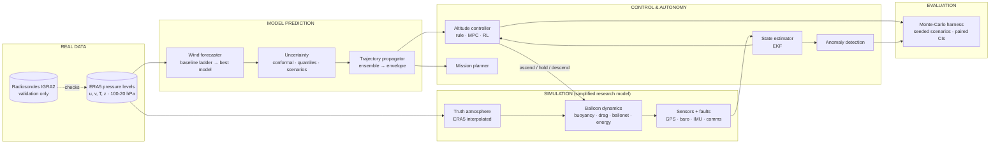

# Roadmap: from wind forecasting to balloon autonomy

Companion to [AUDIT.md](AUDIT.md). Written 2026-10-03, before any of this is
built. Nothing below is a result; everything is a plan, and each plan says what
evidence would make us drop the technique.

## 1. What the project becomes

A closed-loop research simulation of an **altitude-controlled super-pressure
balloon**:

- It is driven by **real** atmospheric data (ERA5).
- It forecasts the wind at several altitudes, with **calibrated uncertainty**.
- It **estimates its own state** from noisy sensors.
- It **chooses its altitude** to steer, using wind layers that blow in different
  directions.
- It is **evaluated over hundreds of seeded missions** against simple baselines.

Every result is labelled as real data, simulation, model prediction or control.
No simulated number is presented as flight performance.

**Vehicle.** No horizontal thrust; altitude changed by pumping air into or out
of a ballonet (the mechanism Loon used). The working altitude band is
configurable. The default is 70–20 hPa (about 18.5–26.5 km), which brackets
Red Balloon's VISTA design float altitude of about 25 km.

**Primary mission metric.** Time within 50 km of a target station, TWR50. This
is the metric used for Loon's station-keeping results (Bellemare et al.,
*Nature*, 2020), so ours can be compared in kind, though not in number.

## 2. Architecture

The truth the simulator flies through (ERA5) and the forecast the controller
sees (model output) are always different objects. The controller never reads
the truth.

## 3. Prioritised roadmap

P0 = needed for a credible autonomous-platform project · P1 = strong
differentiator · P2 = advanced research · P3 = polish.
Size: S under a session, M one to two sessions, L three or more.

| # | Pri | Work item | Size | Done when |
|---|---|---|---|---|
| 0 | P0 | Correct the two README claims flagged in the audit; tag current `main` as `v1-wind-forecast` | S | Public README matches the measured feedback result |
| 1 | P0 | Package skeleton (`src/stratoballoon/`), YAML configs, run metadata (config, git hash, data hash, seed), CI on a synthetic dataset | M | `pytest` passes in GitHub Actions without ERA5 |
| 2 | P0 | Dataset v2: levels 100/70/50/30/20 hPa, u/v/T/z, 6-hourly, 2015-01 to 2026-09; checksummed manifest; derived variables; rolling-origin splits with embargo | M (+~10 h unattended download) | Manifest and EDA regenerate from config |
| 3 | P0 | Baseline ladder and metric suite, pooled over grid points, all levels, 6-72 h, block-bootstrap CIs | M | Comparison table with CIs |
| 4 | P0 | Probabilistic forecasting: split-conformal and quantile intervals on the wind vector; reliability; correlated scenario sampler | M | Coverage within ±3 points of nominal on held-out years |
| 5 | P0 | Digital twin v1: ERA5-driven super-pressure balloon with ballonet, rate limits, energy, documented assumptions | L | Unit tests on equilibrium altitude and energy accounting; assumptions page |
| 6 | P0 | Trajectory propagation and evaluation at 6-72 h for each forecast source | M | Position-error table and cone coverage |
| 7 | P0 | Closed-loop controllers: rule-based, MPC (deterministic and uncertainty-aware) | L | Paired TWR50 comparison |
| 8 | P0 | Monte-Carlo harness: ≥ 500 seeded scenarios, identical for every controller, paired CIs, all missions reported | M | One command reproduces the table |
| 9 | P0 | README rewrite with real / simulation / prediction / control separated | M | Every number generated from results |
| 10 | P1 | EKF: position, velocity, altitude and online wind-error estimate; GPS outage handling; effect on control | M | Normalised estimation error consistent; TWR50 with and without |
| 11 | P1 | Tree ensembles, LSTM v2, temporal CNN in the ladder; ablations; permutation importance | M | Kept only if CI beats ridge |
| 12 | P1 | Failure injection and comms-loss autonomy (stale forecasts, store-and-forward telemetry) | M | TWR50 against outage length |
| 13 | P1 | Telemetry anomaly detection: innovation test, CUSUM, Isolation Forest, autoencoder | M | Precision, recall, false alarms per day, delay |
| 14 | P1 | Mission planner CLI | S | Strategy, track fan, success probability from one config |
| 15 | P1 | ERA5 vs radiosonde validation; VISTA flight case study | M | Measured reanalysis error at float levels |
| 16 | P1 | One-page summary, 3-min demo flow, 10-min explanation, interview questions | M | Written from final results |
| 17 | P2 | Reinforcement learning (PPO) on the same environment and scenarios | L | Reported whether or not it wins |
| 18 | P2 | Edge: ONNX export, profiling of the *planner* (the real onboard cost), target-hardware run if a board is available | M | Measured, or explicitly marked unmeasured |
| 19 | P2 | Transformer, only if item 11 shows a neural model beating ridge | M | Skipped otherwise, with the reason |
| 20 | P2 | UKF, only if the EKF is measurably inconsistent | S | Skipped otherwise |
| 21 | P3 | Interactive mission dashboard (offline HTML, like the current `demo.html`) | M | — |

**Not built now:** items 9 and 16 (README, interview material) are written only
after results exist. Writing them first would mean describing results nobody
has measured.

## 4. Dataset plan

| Choice | Value | Reason |
|---|---|---|
| Source | ERA5 pressure levels (Copernicus CDS) | Open, global, hourly, standard for this altitude |
| Levels | 100, 70, 50, 30, 20 hPa (~16.5–26.5 km) | Spacing of 2–3.5 km matches what a ballonet can traverse; includes VISTA's ~25 km |
| Variables | u, v, T, geopotential z | z gives true altitude; T and pressure give air density for buoyancy |
| Time step | 6-hourly | CDS cost scales with time steps, not area; 6-hourly fits a 10-year record into roughly 10 h of download |
| Period | 2015-01 to 2026-09 | About 4.5 cycles of the quasi-biennial oscillation; 2026 includes the VISTA flight |
| Region | 5–35°N, 60–100°E at 1° | Unchanged; covers India and the Bay of Bengal |
| Derived | speed, direction, density ρ = p/(R·T), geometric altitude, shear between adjacent levels, potential temperature | Inputs for both the forecaster and the physics |
| Versioning | manifest with request parameters, file SHA-256, download date, preliminary-data flag (ERA5T) | Proves which data a result used |
| Splits | rolling origin: test on 2022, 2023, 2024 in turn, training on all earlier years, validation on the year before each test year, 3-day embargo at every boundary; 2025-01 to 2026-09 held out and scored once at the end | Covers every season; final holdout is truly unseen |
| Validation data | IGRA2 radiosondes at Indian stations | Measures how far ERA5 is from observations at these levels |

The existing 3-hourly 2022–2024 files stay; v1 remains reproducible from tag
`v1-wind-forecast`.

## 5. Model plan

| Rung | Model | Why it is on the ladder |
|---|---|---|
| 1 | Persistence | The baseline any forecast must beat |
| 2 | Tide-aware persistence | Audit shows a 24 h tide; this is the honest version of persistence |
| 3 | Climatology (by month and hour) | Long-horizon floor; should win at 72 h if nothing else does |
| 4 | Moving average | Tests whether smoothing alone helps |
| 5 | Linear regression and ridge | Current winner; cheap, interpretable, easy to verify onboard |
| 6 | Gradient-boosted trees | Captures non-linear regime effects (monsoon, QBO phase) without sequence modelling |
| 7 | LSTM (pooled across grid points) | Gets 100× more training windows than v1; tests whether data was the LSTM's problem |
| 8 | Temporal CNN | Cheaper sequence model; a fair test of "is sequence modelling useful here" |
| 9 | Transformer | Only if rung 7 or 8 beats ridge outside the CI |

**Targets.** (u, v) at all five levels, at 6, 12, 24, 48 and 72 h.

**Inputs.** The local column history, a 3×3 neighbourhood, hour and day-of-year
encoded as sine and cosine, latitude and longitude.

**Explainability.** Permutation importance and level/variable ablations.

**Uncertainty.**
- Split-conformal intervals on each wind component, and on vector error
  magnitude.
- Quantile regression from the tree model.
- A seed ensemble for the neural models.
- Monte-Carlo dropout reported but not trusted unless it calibrates.

Calibration is checked with reliability diagrams, interval coverage and width,
CRPS, and spread–skill plots.

**Scenario sampler.** The controller needs sampled wind futures, not just
intervals. The sampler draws whole residual sequences from the validation
period (a block bootstrap). That keeps the realistic correlation of errors
across time and altitude.

## 6. Simulation plan (digital twin)

Labelled everywhere as a **simplified research simulation, not flight-certified**.

| Component | Model | Key assumption to document |
|---|---|---|
| Atmosphere | ERA5 fields, interpolated bilinearly in space, linearly in log-pressure and in time | 1° and 6-hourly resolution smooths out small-scale gusts and gravity waves |
| Horizontal motion | Balloon velocity relaxes to the local wind with a drag time constant | Relaxation takes minutes, so velocity is effectively the wind |
| Vertical motion | Buoyancy (ρ·V − m)·g minus quadratic drag; super-pressure keeps volume constant | Envelope never goes slack; no structural limits |
| Altitude control | Ballonet air mass; pumping in costs energy (descend), venting is free (ascend); rate limits | Pump power and efficiency are parameters, not measured hardware |
| Energy | Battery plus solar charging by sun elevation; avionics base load | No degradation unless injected as a fault |
| Thermal | Gas temperature follows air temperature, plus an optional daytime superheat offset | Simplified radiation |
| Sensors | GPS (noise, dropout), barometer, thermometer, IMU (noise and bias), telemetry link (on/off, latency) | Noise levels from typical datasheets, cited |
| Step | 60 s dynamics, controller decision every 1–3 h, vectorised across missions | — |

The simulation is checked by tests (equilibrium altitude matches the density
from the buoyancy equation; energy is conserved in the accounting), not by
asserting realism.

## 7. Controller plan

| Controller | Description | Why it is included |
|---|---|---|
| Hold | Never changes altitude | The do-nothing baseline every controller must beat |
| Rule-based | Picks the level whose forecast wind points most towards the target, with hysteresis | Simple, transparent; often hard to beat |
| MPC, deterministic | Searches altitude plans over 24 h on the point forecast, executes the first step, replans | Uses the forecast properly |
| MPC, uncertainty-aware | Same search, scored as expected cost plus a tail-risk term over scenario samples | Tests whether uncertainty improves the mission |
| RL (P2) | PPO on the same environment, trained on training years, tested on held-out scenarios | Loon's approach; included to be compared, not assumed better |

**Shared cost.** Distance to target, energy used, altitude changes, and time
spent outside the safe band.

**Shared scenarios.** Every controller flies the identical seeded scenarios, so
the comparison is paired.

## 8. Evaluation plan

| Level | Question | Metric | Statistics |
|---|---|---|---|
| Forecast | Which model is the simplest adequate one? | MAE, RMSE, bias, correlation, vector and direction error, at each horizon and level | Block bootstrap; paired differences |
| Uncertainty | Are intervals honest? | Coverage, width, CRPS, reliability, spread–skill | Per held-out year |
| Trajectory | How far off is the predicted track? | Great-circle error at 6–72 h; cone coverage; region-entry probability (Brier score) | Per forecast source |
| Estimation | How good is the EKF? | Position and velocity RMSE, consistency (NEES), error growth during GPS outage | — |
| Control | Does the controller help the mission? | TWR50, energy, altitude changes, worst-case distance | Paired bootstrap over ≥ 500 scenarios; every scenario reported |
| Robustness | What breaks it? | Same metrics under each injected fault | Failure-mode table |
| Anomaly | Does it catch faults? | Precision, recall, false alarms per day, detection delay | Per fault type |
| Edge | Can it run onboard? | Size, RAM, latency, CPU, energy per decision | Measured on hardware, or marked unmeasured |

## 9. Experiment plan

| ID | Hypothesis | Decision rule |
|---|---|---|
| E1 | With pooled multi-point data, a neural model beats ridge | Keep neural only if the paired CI excludes zero at ≥ 2 horizons |
| E2 | Forecast skill over climatology vanishes by 72 h | Report the horizon where it does; the controller stops trusting the forecast beyond it |
| E3 | Conformal intervals stay calibrated across held-out years | Coverage within ±3 points of nominal |
| E4 | ERA5 differs from radiosondes by more than the forecast error at 6 h | If true, forecast skill claims carry an explicit caveat |
| E5 | Closed-loop altitude control beats Hold on TWR50 | Paired CI |
| E6 | MPC beats the rule-based controller | Paired CI; otherwise ship the rule |
| E7 | Uncertainty-aware MPC beats deterministic MPC on worst-case or energy | Paired CI on worst-case distance and energy |
| E8 | The EKF's wind-error estimate improves control | TWR50 with and without |
| E9 | Onboard autonomy degrades gracefully with comms loss | TWR50 against outage length; no unsafe states |
| E10 | The innovation test detects sensor faults as well as ML detectors | Compare recall at equal false-alarm rate |
| E11 | RL matches or beats MPC | Reported either way |
| E12 | The planner, not the forecaster, dominates onboard compute | Measured profile |

## 10. Why each advanced technique, and when to drop it

| Technique | Problem it solves | Baseline it must beat | Trade-off | Drop if |
|---|---|---|---|---|
| Conformal / quantile intervals | Controller must not trust a point forecast | Fixed-width residual interval (v1) | Needs held-out calibration data | Never; uncertainty is the point |
| EKF | Noisy sensors, GPS outages, unknown forecast error | Raw GPS | Tuning; model mismatch | It does not improve control or outage error |
| MPC | Exploit forecast wind layers over hours | Rule-based | Compute grows with horizon and branching | Rule-based is within the CI |
| RL | Policies that MPC's search misses | MPC | Training cost, sim-to-real gap, hard to verify | It does not beat MPC (likely; reported anyway) |
| Temporal CNN / LSTM | Non-linear temporal patterns | Ridge, gradient-boosted trees | Training cost, opacity | Not better outside the CI |
| Transformer | Long-range dependencies | Best of the above | Data-hungry | Item 19's condition fails |
| Isolation Forest / autoencoder | Faults that simple tests miss | Innovation test, CUSUM | False alarms; opaque | No recall gain at equal false-alarm rate |
| Digital twin | Testing control safely, at scale | — | Realism is limited | Never; it is the test bench, labelled as such |

LLMs are not in scope. No step of this problem needs one.

## 11. Weaknesses that remain even if everything is built

- **No real flight data.** Control performance is simulated. The VISTA case
  study can only check a trajectory, and only coarsely, because the public
  record gives launch and landing districts, not a track.
- **ERA5 is both the truth and the training data.** Item 15 measures how far it
  is from observations, but cannot remove the problem.
- **No operational forecast archive at these levels.** WeatherBench 2's
  operational forecasts include only 50 and 100 hPa in the stratosphere. So the
  controller's forecast is our model, not what an operator would actually
  receive.
- **The physics is simplified.** No gravity waves, no radiation model, no
  envelope structure.
- **One region.** South Asia only.
- **Edge figures are unmeasured** unless a target board is available.

## 12. Learning checkpoints

This project is only an asset if its author can explain every part. After each
P0 item, the author should be able to explain, without notes:

| After item | Explain |
|---|---|
| 2 | Why pressure levels, why chronological splits with an embargo, what a reanalysis is |
| 3 | Persistence, climatology, ridge; RMSE vs bias; why a confidence interval on a skill score |
| 4 | What 90 % coverage means; why conformal prediction needs no model assumptions |
| 5 | Why a super-pressure balloon floats at constant density; how a ballonet changes altitude |
| 6 | Why a forecast error of 2 m/s becomes 170 km in a day |
| 7 | What receding-horizon control is; why feedback beats open loop |
| 8 | Why the same scenarios for every controller; what a paired comparison is |

## Sources

- Bellemare, M. G. et al. (2020). *Autonomous navigation of stratospheric
  balloons using reinforcement learning.* Nature 588, 77–82.
- Google Research, *The Balloon Learning Environment*:
  <https://github.com/google/balloon-learning-environment>
- Rasp, S. et al. (2024). *WeatherBench 2.* <https://arxiv.org/abs/2308.15560>
- VISTA flight record: <https://stratocat.com.ar/fichas-e/2026/VIJ-20260527.htm>
- Hersbach, H. et al. (2020). *The ERA5 global reanalysis.* QJRMS 146, 1999–2049.
